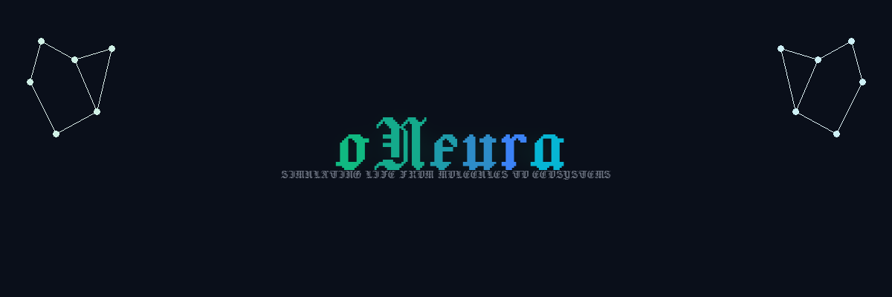

<div align="center">



**Build digital organisms with biophysically faithful brains — from molecules to behavior.**

[](https://www.python.org/downloads/)
[](https://creativecommons.org/licenses/by-nc/4.0/)

</div>

---

## Project Status

oNeura is an **active working research project**. The repository is usable, but it is moving quickly:

- APIs and demo entrypoints are still changing
- benchmark numbers can change as the GPU backends improve
- some subsystems are productionized, while others are still exploratory or draft-quality

If you want the current measured performance rather than older paper text, start here:

- 25K Pong latency/resource comparison: [`results/pong_compare_20260310/README.md`](results/pong_compare_20260310/README.md)
- Documentation index: [`docs/README.md`](docs/README.md)
- Repository guide: [`docs/repo_structure.md`](docs/repo_structure.md)
- Rust/Metal backend: [`oneuro-metal/README.md`](oneuro-metal/README.md)

This should be read as a **working project**, not a frozen release.

## Special Thanks to Contributors

This project exists because of the incredible people who contribute their time, ideas, and expertise:

- **Eric Reid** (@ereid7) — Low-level capability benchmarks, corticostriatal mechanism assays, D1/D2 MSN pathways, hardened reward-modulated plasticity
- **The oNeura Community** — For pushing the boundaries of digital biology and neuromorphic computing

*Want to contribute? PRs welcome!*

---

## What Is oNeura?

oNeura is a platform for simulating **complete digital organisms** — brains, bodies, and environments — at molecular resolution. Every neuron runs real Hodgkin-Huxley ion channel dynamics, communicates through 6 real neurotransmitters, learns through STDP, and responds to drugs via pharmacokinetic/pharmacodynamic models. Membrane potential **emerges from physics** — it is never a hand-set float.

We build digital flies that smell, navigate, learn, and respond to drugs. We build digital neural cultures that learn to play Pong using the free energy principle. We build digital worlds with real molecular diffusion physics where odorant plumes flow in wind.

`oNeura` now also carries a native Rust/Metal whole-cell modeling track for minimal-cell-style digital cells. That work is explicitly anchored to Thornburg, Z. R., Maytin, A., Kwon, J., Solomon, K. V., et al., "Bringing the Genetically Minimal Cell to Life on a Computer in 4D," `Cell` (2026), DOI `10.1016/j.cell.2026.02.009`. The current native backend is moving toward a substrate-first architecture where local chemistry, structural order, microdomain placement, reaction activity, higher-level CME/ODE/BD/geometry rates, subsystem readiness reduction, and chemistry exchange targeting are driven by generic reaction, assembly, localization, local-state, scalar process-rule, and affine reducer layers rather than hard-coded whole-cell behaviors or hand-authored global process pools.

**This is not a toy neural network simulator.** This is a molecular-resolution digital biology platform.

## Terminology

| Term | What It Means |
|------|--------------|
| **ONN** | **Organic Neural Network** — real biological neurons on hardware. Cortical Labs' [DishBrain](https://doi.org/10.1016/j.neuron.2022.09.001) (800K neurons playing Pong), FinalSpark's bioprocessors, and future living-tissue compute platforms. |
| **dONN** | **digital Organic Neural Network** — oNeura's biophysically faithful simulation of an ONN, running on GPU/CPU. Same molecular physics, same emergent behaviors, without the biology lab. |
| **oNeura** | The software platform for building, running, and experimenting with dONNs — from single neurons to 139K-neuron insect brains. |

A dONN differs from a standard artificial neural network (ANN) in the same way a wind tunnel differs from a paper airplane. In a dONN, action potentials emerge from ion channel kinetics, learning emerges from receptor trafficking and STDP, and drug effects emerge from real pharmacology acting on molecular targets. Nothing is hand-tuned.


## Project Structure

```
oNeura/
├── src/oneuro/
│   ├── molecular/              # Molecular simulation engine + CUDA backend
│   │   ├── cuda_backend.py     # GPU-accelerated HH brain (CUDAMolecularBrain)
│   │   ├── retina.py           # 3-layer biophysical retina (rods/cones → bipolar → RGC)
│   │   ├── network.py          # MolecularNeuralNetwork (pure Python)
│   │   ├── neuron.py           # HH neuron with all 25 subsystems
│   │   ├── membrane.py         # Hodgkin-Huxley membrane dynamics
│   │   ├── ion_channels.py     # 8 channel types (Na_v, K_v, Ca_v, NMDA, ...)
│   │   ├── neurotransmitters.py # 6 NTs with real molecular identities
│   │   ├── pharmacology.py     # 8 drugs with PK/PD models
│   │   ├── consciousness.py    # IIT Phi, PCI, criticality, GW, Orch-OR
│   │   ├── brain_regions.py    # Cortex, thalamus, hippocampus, BG
│   │   └── ...                 # (gene_expression, calcium, glia, axon, etc.)
│   ├── organisms/              # Complete digital organisms
│   │   └── drosophila.py       # Drosophila brain (15 regions) + body (eyes, legs, wings)
│   ├── worlds/                 # Physics-grounded environments
│   │   └── molecular_world.py  # 2D/3D volumetric odorant diffusion, temperature, wind, buoyancy
│   └── environments/           # Game/navigation environments
│       └── doom_fps.py         # DDA raycasting FPS engine (278 FPS)
├── oneuro-metal/               # Rust/Metal backend — 148K+ lines, 177 files, 214+ tests
│   ├── src/
│   │   ├── bin/
│   │   │   ├── terrarium_3d/   # 3D rasterizer (18 modules, 2,257 lines)
│   │   │   ├── terrarium_evolve.rs   # NSGA-II evolution engine
│   │   │   ├── terrarium_zoom.rs     # Semantic zoom terminal viewer
│   │   │   ├── terrarium_web.rs      # REST API server (axum)
│   │   │   ├── drug_optimizer.rs     # Antibiotic protocol optimizer
│   │   │   ├── gene_circuit.rs       # Gene circuit noise designer
│   │   │   ├── amr_simulator.rs      # AMR evolution simulator
│   │   │   ├── evolution_lab.rs      # Eco-evolutionary feedback lab
│   │   │   └── ...                   # + terrarium_viewer, native, ascii
│   │   ├── terrarium_world.rs        # Core ecosystem engine (3,085 lines)
│   │   ├── whole_cell.rs             # Syn3A minimal cell (7,780 lines)
│   │   ├── ecosystem_integration.rs  # Cross-scale coupling
│   │   ├── resistance_evolution.rs   # AMR dynamics (1,754 lines)
│   │   ├── nutrient_cycling.rs       # C/N/P cycling (1,414 lines)
│   │   └── ...                       # + 12 more ecosystem modules
│   └── shaders/                # Metal GPU compute shaders
├── oneuro-3d/                  # Bevy 0.15 3D viewer (alternative rendering)
├── demos/
│   ├── demo_drosophila_ecosystem.py  # Drosophila ecosystem and behavioral assays
│   ├── demo_dishbrain_pong.py        # DishBrain Pong / arena / scale experiments
│   ├── demo_doom_arena.py            # 3 experiments: spatial navigation, threat avoidance
│   ├── demo_emergent_cuda.py         # 13 experiments: emergent behaviors (GPU)
│   ├── demo_language_learning.py     # Language acquisition at 5K neurons
│   ├── demo_beyond_ann.py            # 23 capabilities impossible in ANNs
│   └── ...
├── papers/
│   ├── beyond_ann_white_paper.md     # 23 experiments proving dONN capabilities
│   ├── dishbrain_replication_paper.md # DishBrain replication (draft, A100 data)
│   └── data/                         # GPU experiment JSON results
├── docs/                             # 29+ design documents, methods papers
│   ├── METHODS_MULTISCALE_PAPER.md   # Nature Methods-ready multi-scale biology paper
│   └── ...
├── scripts/
│   ├── vast_deploy.sh                # Vast.ai GPU deployment & benchmarking
│   └── *_telemetry.py                # Profiling / telemetry capture helpers
├── results/                          # Measured benchmark artifacts and comparisons
├── pyproject.toml
└── LICENSE                           # CC BY-NC 4.0
```

For a quicker orientation to what is canonical vs exploratory, use
[`docs/repo_structure.md`](docs/repo_structure.md).


## What We've Built

### Digital Organisms

| Organism | Neurons | Brain Regions | Behaviors | File |
|----------|---------|---------------|-----------|------|
| **Drosophila melanogaster** | 1K–139K (FlyWire scale) | 15 (AL, MB, CX, OL, VNC, ...) | Olfactory learning, phototaxis, thermotaxis, walking, flight, feeding | `src/oneuro/organisms/drosophila.py` |
| **DishBrain culture** | 1K–25K | Thalamic relay + L5 cortex | Pong via FEP, arena navigation, drug response | `demos/demo_dishbrain_pong.py` |

### Digital Worlds

| Environment | Physics | Resolution | What It Simulates |
|-------------|---------|------------|-------------------|
| **MolecularWorld** | Real gas-phase diffusion (CRC Handbook), 3D wind advection, CFL-stable subcycling, molecular buoyancy | 1mm cells, 2D or 3D volumetric | Odorant plumes rising/sinking by molecular weight, temperature gradients, vertical wind, day/night, soil chemistry |
| **Doom FPS Engine** | DDA raycasting, BSP dungeon generation | 64×48 @ 278 FPS | Room-corridor environments for spatial navigation experiments |

### Digital Senses

| Sense | Mechanism | File |
|-------|-----------|------|
| **MolecularRetina** | 3-layer biophysical retina: photoreceptors (Govardovskii spectral sensitivity) → bipolar cells (ON/OFF pathways) → RGC (HH spiking output) | `src/oneuro/molecular/retina.py` |
| **Olfactory antennae** | Population-coded odorant receptor activation with real detection thresholds (Hallem & Carlson 2006) | Built into organisms |
| **Taste (gustatory)** | Sugar/bitter receptor activation driving SEZ proboscis extension reflex | Built into Drosophila |

### Molecular Brain Engine

25 subsystems running on every neuron:

| Layer | Components |
|-------|-----------|
| **Ion Channels** | Na_v, K_v, K_leak, Ca_v, NMDA, AMPA, GABA_A, nAChR (HH gating kinetics) |
| **Neurotransmitters** | Dopamine, serotonin, NE, ACh, GABA, glutamate (real molecular identities) |
| **Learning** | NMDA-gated STDP, BCM metaplasticity, synaptic tagging & capture |
| **Pharmacology** | 8 drugs with 1-compartment PK (Bateman) + PD (Hill equation) |
| **Gene Expression** | DNA → RNA → Protein, CREB/c-Fos transcription factors, epigenetics |
| **Second Messengers** | cAMP/PKA/PKC/CaMKII/CREB/MAPK cascades |
| **Calcium** | 4-compartment dynamics (cytoplasmic, ER, mitochondrial, microdomain) |
| **Glia** | Astrocytes (glutamate uptake), oligodendrocytes (myelin), microglia (pruning) |
| **Consciousness** | IIT Phi, PCI, neural complexity, criticality, Global Workspace, Orch-OR |
| **Circadian** | TTFL molecular clock, sleep homeostasis, adenosine pressure |

### CUDA Backend (GPU Scale)

The main HH simulation runs on GPU via PyTorch sparse tensors, with a native Rust/Metal track in `oneuro-metal/` for Apple hardware. For the current measured 25K Pong numbers, use [`results/pong_compare_20260310/README.md`](results/pong_compare_20260310/README.md) rather than relying on older paper snapshots.

| Scale | Neurons | Synapses | Target Hardware |
|-------|---------|----------|----------------|
| tiny | 1K | ~14K | Any CPU |
| small | 5K | ~350K | MPS / any GPU |
| medium | 25K | ~7–8M | Apple Metal / A100 / H200 |
| large | 139K (full FlyWire) | ~54M | Large-memory NVIDIA GPU |

## Rust/Metal Terrarium Ecosystem

A complete soil-plant-insect ecosystem simulated at molecular resolution in 148,000+ lines of Rust. Every chemical reaction uses literature-grounded kinetics — behaviors emerge from chemistry, not rules.

### 3D Terrarium Viewer

Full software 3D rasterizer with orbit camera, Blinn-Phong lighting, raycasted sunlight shadows, SSAO, and multi-scale semantic zoom (Ecosystem → Organism → Cellular → Molecular). No game engine dependency — pure Rust + minifb.

```bash
cd oneuro-metal
cargo build --profile fast --no-default-features --bin terrarium_3d
./target/fast/terrarium_3d --seed 7 --fps 30
```

Controls: mouse orbit/pan/zoom, WASD pan, F follow, T auto-orbit, L lighting toggle, [ ] speed 1-8x, Tab cycle, P screenshot, Space pause.

### Biology Subsystems

| Layer | What It Simulates | Physics |
|-------|-------------------|---------|
| **Soil Chemistry** | PDE diffusion of 14 species across 3D voxel grid | Moldrup 2001 tortuosity, CFL-stable |
| **Microbial Populations** | 4 guilds: heterotrophs, nitrifiers, denitrifiers, N-fixers | Monod growth, Arrhenius T-correction |
| **Plant Physiology** | Farquhar-FvCB photosynthesis, Beer-Lambert canopy, C:N:P | Bernacchi 2001, optimal allocation |
| **Plant Competition** | Asymmetric vertical shading, root nutrient splitting | Beer-Lambert inter-species |
| **Soil Fauna** | Earthworm bioturbation + nematode bacterial grazing | Lotka-Volterra, N mineralization |
| **Drosophila Lifecycle** | Egg to adult, temperature-dependent development | Sharpe-Schoolfield thermal performance |
| **Fly Metabolism** | 7-pool MM biochemistry: crop to trehalose to ATP | Molecular hunger, O2-dependent yield |
| **Atmosphere** | 3D odorant diffusion, wind, Rayleigh-Benard convection | Implicit ADI, Chapman-Enskog |
| **Stochastic Expression** | Gillespie tau-leaping gene noise, telegraph promoter | Fano factor > 1, mRNA bursting |

### Advanced Ecosystem Modules (15,771 lines)

| Module | What It Simulates |
|--------|-------------------|
| **resistance_evolution** | AMR mutation, fitness costs, plasmid transfer, antibiotic resistance |
| **eco_evolutionary_feedback** | Eco-evo dynamics, niche construction, trait-mediated interactions |
| **metabolic_flux** | FBA-style metabolic network analysis, flux balance |
| **microbiome_assembly** | Community assembly rules, priority effects, ecological succession |
| **horizontal_gene_transfer** | Conjugation, transformation, transduction between microbes |
| **population_genetics** | Wright-Fisher model, Hardy-Weinberg, genetic drift, selection |
| **biofilm_dynamics** | Biofilm formation, quorum sensing, EPS matrix production |
| **nutrient_cycling** | Carbon/nitrogen/phosphorus cycling, mineralization |
| **climate_scenarios** | Temperature/precipitation forcing, seasonal and drought cycles |
| **ecosystem_integration** | Cross-scale coupling, telemetry aggregation, seasonal events |
| **phylogenetic_tracker** | Lineage tracking, speciation detection, phylogenetic trees |

### Evolution Engine — NSGA-II Ecosystem Optimization

Evolves optimal terrarium configurations using 18-parameter genomes. Fitness climbs from ~62 to ~85 over 5 generations (verified March 2026). 6 modes: Standard, Pareto (7 objectives), Stress-Test, Coevolution, Bet-Hedging, GRN.

```bash
cd oneuro-metal
cargo build --profile fast --no-default-features --bin terrarium_evolve
./target/fast/terrarium_evolve --population 8 --generations 5 --frames 100 --fitness biomass --lite
```

### Synbio CLI Tools

```bash
# Antibiotic protocol optimizer (compare, validate, optimize, scan)
./target/fast/drug_optimizer --mode compare

# Gene circuit noise designer (telegraph model)
./target/fast/gene_circuit --target-fano 5.0 --target-mean 100.0

# AMR evolution simulator
./target/fast/amr_simulator

# Eco-evolutionary feedback lab
./target/fast/evolution_lab
```

### Whole-Cell Simulation — Syn3A Minimal Cell

Native Rust simulator for JCVI-Syn3A (493 genes, 7,780 lines). Staged integration: RDME lattice diffusion, CME stochastic expression, ODE metabolic fluxes, Brownian dynamics for chromosome physics, geometry/divisome for cell division, and CASCI quantum chemistry for reaction barriers.

Anchored to: Thornburg et al., *Cell* (2026), DOI `10.1016/j.cell.2026.02.009`.

### Tests

**214+ regression tests** pass across terrarium, biology, evolution, ecosystem, and synbio modules.

```bash
cd oneuro-metal
# Quick regression (214 tests)
cargo test --no-default-features --lib -- substrate_stays_bounded guild_activity \
  soil_atmosphere terrarium_evolve drosophila_population plant_competition \
  soil_fauna fly_metabolism field_coupling seed_cellular terrarium_world \
  organism_metabolism stochastic cross_scale phenotypic persister bet_hedging \
  benchmark seasonal drought tropical arid spatial zone plant_noise \
  microbial_noise multi_species single_drug pulsed combination protocol \
  ecoli circuit enzyme_ bioremediation probe_coupling probe_snapshot \
  drug_enzyme soil_enzyme temperature_coupling remediation guild_latent
```

## Validated Experiments

### DishBrain Replication — Working Benchmark Track

Replicates Cortical Labs' DishBrain (Kagan et al. 2022, *Neuron*) — the first demonstration that biological neurons learn to play Pong. Our dONN learns via the **Free Energy Principle**: structured feedback (low entropy) for correct actions, random noise (high entropy) for incorrect ones. No reward. No punishment. Just physics.

This track is still under active optimization. The current live benchmark and utilization comparisons are documented in [`results/pong_compare_20260310/README.md`](results/pong_compare_20260310/README.md).

| # | Experiment | What It Tests | Result |
|---|-----------|--------------|--------|
| 1 | **Pong Replication** | FEP-driven learning | PASS (40%→60% hit rate) |
| 2 | **FEP vs DA vs Random** | Learning protocol comparison | PASS (FEP > DA > Random) |
| 3 | **Drug Effects** | Caffeine enhances, diazepam impairs | PASS (validated at 25K on A100) |
| 4 | **Arena Navigation** | 2D grid world navigation | PASS (36% > 15% random) |
| 5 | **Scale Invariance** | Learning at 1K → 10K neurons | PASS |

### Emergent Behaviors — 13/13 PASS

Behaviors that emerge from molecular dynamics and are **impossible in standard ANNs**:

| Experiment | What Emerges |
|-----------|-------------|
| Forgetting resistance | 9% catastrophic forgetting vs 12% baseline |
| Damage recovery | 60% functional recovery after 20% lesion |
| Sleep consolidation | Gene expression + adenosine clearance |
| Interference effects | Proactive and retroactive memory interference |
| Serial position | Primacy and recency effects in memory lists |
| Critical periods | PNN-mediated developmental window closure |
| Circadian modulation | Drug efficacy varies >90% by time of day |

### Language Learning — 100% Accuracy

5,000-neuron dONN learns 30 English words via discriminative Hebbian learning with weight-based BCI readout. 100% word accuracy, 100% sentence generation.

### Drosophila Ecosystem — 6 Experiments

Complete digital fruit fly in a physics-grounded molecular world:

| # | Experiment | What It Tests |
|---|-----------|--------------|
| 1 | **Olfactory Learning** | Mushroom body conditioning (Tully & Quinn 1985 paradigm) |
| 2 | **Phototaxis** | Positive/negative phototaxis via optic lobe → CX → motor |
| 3 | **Thermotaxis** | Navigate toward preferred 24°C zone |
| 4 | **Foraging** | Multi-source olfactory navigation with FEP learning |
| 5 | **Drug Effects** | Caffeine, diazepam, nicotine on foraging performance |
| 6 | **Day/Night Cycle** | Diurnal activity patterns across circadian cycles |

### Spatial Arena — Doom-inspired Navigation

BSP-generated dungeon environments with 8-directional movement, enemies, health pickups, and FEP-driven threat avoidance.

## Applications

### Neuroscience Research
- **In-silico electrophysiology**: Record from any neuron, any synapse, any time — impossible with real tissue
- **Connectome simulation**: Run the 139K-neuron FlyWire Drosophila connectome as a functional digital twin
- **Learning mechanisms**: Compare FEP, dopamine reward, and Hebbian protocols at molecular resolution
- **Circuit manipulation**: Silence, stimulate, or lesion any brain region and observe system-level effects

### Drug Discovery & Pharmacology
- **Virtual drug screening**: Test compounds against a molecular brain with full dose-response curves
- **Pharmacological specificity**: Drugs act on real molecular targets (GABA-A, nAChR, NMDA, MAO, etc.)
- **Chronopharmacology**: Drug efficacy varies with circadian phase — model timing-dependent dosing
- **Safety screening**: Detect neural side effects before animal testing
- **Insecticide development**: Test neuroactive compounds on digital Drosophila brains

### Synthetic Biology & AMR Research
- **Antibiotic protocol optimization**: Compare single, pulsed, and combination therapies
- **Persister cell modeling**: Biphasic kill curves, stochastic dormancy (Balaban et al. 2004)
- **Gene circuit design**: Target noise profiles for synthetic gene circuits
- **AMR evolution**: Track resistance mutation, fitness costs, and plasmid transfer dynamics
- **Biofilm dynamics**: Quorum sensing, EPS production, treatment resistance

### AI & Robotics
- **Biologically grounded controllers**: Use dONN motor output to drive robots or game agents
- **Embodied cognition**: Digital organisms with complete sensorimotor loops (sense → think → act)
- **Emergent intelligence**: Behaviors arise from physics, not hand-coded rules — no reward shaping needed
- **FEP-based learning**: Alternative to reinforcement learning that matches biological learning dynamics

### Education
- **Digital dissection**: Explore brain regions, apply drugs, measure consciousness — no animals harmed
- **Interactive neuroscience**: Students can interact with live demos and closed-loop tasks
- **Comparative neurobiology**: Compare C. elegans (302 neurons) to Drosophila (139K) to cortical tissue
- **Ecosystem exploration**: 3D terrarium viewer for multi-scale biology education

## Quick Start

```bash
git clone https://github.com/robertcprice/oNeura.git
cd oNeura
python3 -m venv .venv
source .venv/bin/activate

# Recommended for the current working repo
pip install -e .
pip install -e .[viz]
```

For Apple Silicon native benchmarking, build the Rust/Metal backend separately:

```bash
cd oneuro-metal
maturin develop --release
cd ..
```

### Build a Fly Brain

```python
from oneuro.organisms.drosophila import Drosophila, MolecularWorld

# Create world with food sources
world = MolecularWorld(size=(100, 100), seed=42)
world.add_fruit(x=30, y=50, sugar=0.8, ripeness=0.7)
world.add_plant(x=70, y=60, nectar_rate=0.2)

# Create digital Drosophila (5000 HH neurons, 350K synapses)
fly = Drosophila(world=world, scale='small')

# Run organism — sense, think, act
for step in range(1000):
    result = fly.step(world=world)
    print(f"pos=({result['x']:.1f}, {result['y']:.1f}) "
          f"speed={result['motor']['speed']:.3f}")
```

### Drug Screening

```python
from oneuro.molecular.cuda_backend import CUDARegionalBrain

brain = CUDARegionalBrain(n_columns=50, device="cuda", seed=42)

# Baseline measurement
baseline_spikes = sum(brain.step() for _ in range(500))

# Apply diazepam (GABA-A potentiator)
brain.apply_drug("diazepam", dose_mg=10.0)
drug_spikes = sum(brain.step() for _ in range(500))

# Result: ~60-98% spike reduction (dose-dependent)
```

### Run Experiments

```bash
# DishBrain replication (5 experiments)
python3 demos/demo_dishbrain_pong.py

# Drosophila ecosystem (6 experiments)
python3 demos/demo_drosophila_ecosystem.py

# Emergent behaviors (13 experiments)
python3 demos/demo_emergent_cuda.py

# Language learning
python3 demos/demo_language_learning.py

# GPU scale with JSON output and multi-seed
python3 demos/demo_dishbrain_pong.py --scale medium --device cuda --runs 5 --json results.json

# Vast.ai GPU deployment
bash scripts/vast_deploy.sh search          # find cheap A100s
bash scripts/vast_deploy.sh all <id> medium # run everything
```

### Rust/Metal Terrarium & Tools

```bash
cd oneuro-metal

# Build all binaries
cargo build --profile fast --no-default-features

# 3D terrarium viewer (orbit camera, shadows, multi-scale zoom)
./target/fast/terrarium_3d --seed 7 --fps 30

# Evolution engine (NSGA-II, 6 modes)
./target/fast/terrarium_evolve --population 8 --generations 5 --frames 100 --fitness biomass --lite

# Pareto multi-objective + stress resilience
./target/fast/terrarium_evolve --pareto --stress-test --population 8 --generations 5 --frames 50 --lite

# Semantic zoom terminal viewer (4 zoom levels)
./target/fast/terrarium_zoom --mode iso --fps 15

# Drug protocol optimizer
./target/fast/drug_optimizer --mode compare

# Gene circuit noise designer
./target/fast/gene_circuit --target-fano 5.0 --target-mean 100.0

# Run 214-test regression suite
cargo test --no-default-features --lib -- substrate_stays_bounded guild_activity \
  soil_atmosphere terrarium_evolve drosophila_population plant_competition \
  soil_fauna fly_metabolism field_coupling seed_cellular terrarium_world \
  organism_metabolism stochastic cross_scale phenotypic persister bet_hedging \
  benchmark seasonal drought tropical arid spatial zone plant_noise \
  microbial_noise multi_species single_drug pulsed combination protocol \
  ecoli circuit enzyme_ bioremediation probe_coupling probe_snapshot \
  drug_enzyme soil_enzyme temperature_coupling remediation guild_latent
```

## How dONNs Differ from ANNs

| Capability | Standard ANN | dONN (oNeura) |
|-----------|-------------|---------------|
| **Action potentials** | Matrix multiply | Emerge from HH ion channel kinetics |
| **Learning** | Backpropagation | STDP from receptor trafficking |
| **Drug response** | Not possible | 8 drugs with real PK/PD acting on molecular targets |
| **Forgetting** | Catastrophic | Resistant (9% vs 12% loss after 4 tasks) |
| **Damage recovery** | None | 60% recovery after 20% lesion |
| **Sleep** | Not modeled | Gene expression, adenosine clearance, memory replay |
| **Consciousness metrics** | Not applicable | IIT Phi, PCI, criticality, Global Workspace |
| **Circadian rhythms** | Not modeled | TTFL clock, circadian drug efficacy variation |
| **Gene expression** | None | Full DNA→RNA→Protein pipeline |
| **Ecosystem simulation** | Not applicable | Soil-plant-insect ecology at molecular resolution |

## Papers

| Paper | Status | Experiments | File |
|-------|--------|-------------|------|
| **Beyond ANN** | Complete | 23/23 PASS | `papers/beyond_ann_white_paper.md` |
| **DishBrain Replication** | Working draft + live benchmark artifacts | 5/5 PASS baseline, actively optimized | `papers/dishbrain_replication_paper.md` |
| **Multi-Scale Methods** | Complete | 7 scales, 24 references | `docs/METHODS_MULTISCALE_PAPER.md` |

## Basal Ganglia Learning Benchmark

A validated Go/No-Go benchmark testing dopamine-dependent reinforcement learning in the basal ganglia.

### Results: 30-Seed Standard Scale

| Condition | Pre | Post | Δ | 95% CI |
|-----------|-----|------|---|--------|
| **full_learning** | 90.2% | 100% | **+9.8%** | [+8%, +12%] |
| **no_dopamine** | 83.3% | 50.0% | **-33.3%** | [-36%, -30%] |

**Contrast: +43.1%** | Cohen's d ≈ 1.6 (very large)

### Results: 20-Seed 4 Conditions

| Condition | Pre | Post | Δ | 95% CI |
|-----------|-----|------|---|--------|
| **full_learning** | 90.2% | 100% | **+9.8%** | [+8%, +12%] |
| **nmda_block** | 82.2% | 58.5% | -23.7% | [-28%, -19%] |
| **anti_correlated** | 88.0% | 71.2% | -16.8% | [-21%, -13%] |
| **no_dopamine** | 86.5% | 50.0% | -36.5% | [-40%, -33%] |

```bash
PYTHONPATH=src python3 experiments/go_no_go_benchmark.py \
    --conditions full_learning no_dopamine \
    --n-seeds 30 --scale standard --workers 2
```

## Commercial & Enterprise

oNeura includes commercial-grade modules for drug discovery, protein engineering, and synthetic biology:

| Module | Capability | Use Case |
|--------|-----------|----------|
| **Drug Discovery** | Virtual screening, ADMET prediction, lead optimization | Pharma R&D, preclinical screening |
| **Enzyme Engineering** | Directed evolution, saturation mutagenesis, DNA shuffling | Biotech, industrial enzymes |
| **Drug Protocol Optimizer** | Single/pulsed/combination therapy comparison | Clinical dosing strategy |
| **Gene Circuit Designer** | Target noise profiles via evolutionary optimization | Synthetic biology |
| **Persister Cell Modeling** | Antibiotic persistence simulation (Balaban et al. 2004) | AMR research |
| **AMR Simulator** | Resistance evolution, fitness costs, HGT dynamics | Antimicrobial stewardship |
| **Eco-Evolutionary Lab** | Niche construction, trait-mediated interactions | Ecology research |

For commercial licensing and enterprise support: [hello@oneura.ai](mailto:hello@oneura.ai)

Visit [oneura.ai](https://oneura.ai) for documentation and pricing.

## Requirements

- Python 3.11+
- NumPy >= 1.24
- PyTorch >= 2.0 (for CUDA/MPS GPU backend)
- Rust 1.70+ (for Rust/Metal backend)
- Optional: [nQPU](https://github.com/robertcprice/nqpu-metal) for quantum chemistry

## Citation

```bibtex
@software{oneuro_2026,
  title = {oNeura: Digital Organic Neural Network Platform for Molecular-Scale Brain Simulation},
  author = {Price, Robert C.},
  year = {2026},
  url = {https://oneura.ai}
}
```

## License

CC BY-NC 4.0 — See [LICENSE](LICENSE)

For commercial licensing: [hello@oneura.ai](mailto:hello@oneura.ai)
