# Low-level capability suite report

_oNeuro benchmark ladder report for the March 9, 2026 full-suite iteration_

---

## 🎯 Purpose

This document is the single entry point for understanding what we tested in
`docs/low_level_capability_tests.md`, what had to be fixed in the repo to make
those tests meaningful, and what the final evidence state is after the latest
full rerun.

The final locked suite run emitted a local JSON artifact under
`experiments/results/`. Generated result JSON files are local execution outputs
and are not part of the PR surface.

The final repo verification run is:

- `PYTHONPATH=src pytest -q`
- Result: `41 passed in 110.26s`

## 🔄 Iteration flow

```mermaid
flowchart LR
    accTitle: Low-level suite iteration flow
    accDescr: This diagram shows how the benchmark ladder was built, debugged, rerun, and locked into one final all-positive suite artifact.

    plan["📋 Define benchmark ladder<br/>8 low-level capability rungs"]
    run["🧪 Execute each rung<br/>collect failures and ambiguities"]
    debug["🔧 Fix simulator and assay bugs<br/>remove confounds"]
    rerun["🔄 Re-run full suite<br/>verify all rungs together"]
    lock["✅ Lock final artifact<br/>write onboarding report"]

    plan --> run --> debug --> rerun --> lock

    classDef primary fill:#dbeafe,stroke:#2563eb,stroke-width:2px,color:#1e3a5f
    classDef warning fill:#fef9c3,stroke:#ca8a04,stroke-width:2px,color:#713f12
    classDef success fill:#dcfce7,stroke:#16a34a,stroke-width:2px,color:#14532d

    class plan,run primary
    class debug warning
    class rerun,lock success
```



## 📊 Final result

The final suite status is `8/8 positive`.

| Benchmark | Claim tested | Final result | Status |
| --- | --- | --- | --- |
| Single-neuron excitability | Membrane dynamics respond meaningfully to channel composition | `Na_v` upshift strongly increases firing; `K_v` upshift suppresses it | Positive |
| Drug response on matched microcircuits | Modeled drugs shift network activity in the expected direction | Diazepam decreases spikes, caffeine increases them | Positive |
| NMDA-dependent plasticity | Rewarded D1-like pairing separates from no dopamine, NMDA block, and D2-like reward | Robust versus NMDA block and D2; modest versus no dopamine | Positive |
| Simple stimulus discrimination | Tiny circuit learns a two-cue mapping | Learned condition improves over controls | Positive |
| Go / No-Go learning | Small corticostriatal circuit learns action bias | Full learning beats no dopamine, reward shuffle, and NMDA block | Positive |
| Classical conditioning | Paired CS+US yields stronger recovery than CS-only control | Paired condition exceeds control after extinction/rest | Positive |
| Short-delay working memory | Short delay is retained while long delay collapses | Short-delay accuracy `1.0`, long-delay accuracy `0.0` | Positive |
| Pattern completion / partial recall | Partial cue drives better recovery than random cue | Partial-cue readout exceeds random cue | Positive |

## 🔧 Critical fixes

These were the changes that turned the ladder from partially negative into a
defensible suite.

| Area | Problem | Fix |
| --- | --- | --- |
| Reward-modulated plasticity | Reward effects were getting truncated too aggressively and were weakly tied to local NMDA/tag state | `MolecularSynapse.apply_reward()` now scales capture by eligibility, NMDA gate, and synaptic tagging instead of a coarse floor-only rule |
| STDP receptor traffic | Any positive LTP or LTD request forced at least one receptor change, so even heavily blocked synapses still learned | STDP now quantizes receptor trafficking without a forced minimum `±1` receptor event |
| Mechanism assay design | `rewarded`, `no_dopamine`, and `nmda_block` variants started from different random initial synapses | Variant-specific seed confound removed so protocol contrasts share the same initial realization |
| Conditioning rung | Initial control gap was too weak and looked ambiguous | After the reward-plasticity fixes, the paired-vs-control conditioning gap became positive with a positive bootstrap interval |
| Suite coherence | Earlier benchmark work existed as separate scripts and spot checks | A single runnable suite now executes the whole ladder and emits one JSON artifact |

The main code surfaces touched during this iteration are:

- `src/oneuro/molecular/synapse.py`
- `experiments/corticostriatal_mechanism_experiment.py`
- `experiments/low_level_capability_suite.py`
- `tests/test_corticostriatal_mechanism.py`
- `tests/test_low_level_capability_suite.py`

## 🧪 Benchmark-by-benchmark findings

### Single-neuron excitability

This rung asks whether the repo is doing more than threshold firing. It passed
cleanly.

| Readout | Value |
| --- | --- |
| Baseline spike-count AUC | `9.0` |
| `Na_v` upregulated spike-count AUC | `118.0` |
| `K_v` upregulated spike-count AUC | `6.0` |
| Selected current | `14.0` |
| Spikes at selected current: baseline / `Na_v` / `K_v` | `1 / 16 / 1` |

Interpretation: the membrane model shows strong excitability sensitivity to
channel composition, which is exactly what this rung is supposed to prove.

### Drug response on matched microcircuits

This rung checks whether pharmacology changes network dynamics in a directionally
credible way on matched seeded circuits.

| Readout | Value |
| --- | --- |
| Diazepam mean spike delta | `-37.5` |
| Diazepam bootstrap CI | `[-42.67, -33.0]` |
| Caffeine mean spike delta | `+8.83` |
| Caffeine bootstrap CI | `[5.33, 12.00]` |

Interpretation: this is one of the cleanest rungs in the suite.

### NMDA-dependent plasticity

This is the core low-level mechanistic rung. It only became trustworthy after
the reward-capture and STDP quantization fixes plus the seed-confound removal.

| Contrast | Final readout |
| --- | --- |
| D1 rewarded vs no dopamine | `+0.0090` delta weight |
| D1 rewarded vs NMDA block | `+0.2167` delta weight, `+10.83` AMPA |
| D1 rewarded vs D2 rewarded | `+0.6367` delta weight |
| D1 immediate vs delayed dopamine | `+0.0248` delta weight |

Interpretation:

- The strongest evidence here is the rewarded D1 separation from NMDA block and
  from rewarded D2.
- The rewarded-vs-no-dopamine contrast is positive but small, so this rung is
  positive and useful, not yet “large-effect textbook-perfect.”

### Simple stimulus discrimination

This is the first clear behavior rung between synapse-level plasticity and
action selection.

| Condition | Mean accuracy improvement |
| --- | --- |
| Full learning | `+0.185` |
| No learning | `+0.090` |
| Label shuffle | `-0.040` |
| NMDA block | `+0.115` |

Paired advantages for `full_learning`:

- Over `no_learning`: `+0.095`
- Over `label_shuffle`: `+0.225`
- Over `nmda_block`: `+0.070`

Interpretation: the microcircuit acquires the cue mapping and the aligned
weights move in the correct direction.

### Go / No-Go learning

This is the more behaviorally meaningful corticostriatal rung built on the
repaired D1/D2 and reward-plasticity surfaces.

| Condition | Mean bias improvement | Mean accuracy improvement |
| --- | --- | --- |
| Full learning | `+0.0402` | `+0.1583` |
| No dopamine | `-0.0099` | `-0.0667` |
| Reward shuffle | `-0.0173` | `-0.1000` |
| NMDA block | `+0.0068` | `+0.0083` |

Paired bias-improvement advantages for `full_learning`:

- Over `no_dopamine`: `+0.0500`
- Over `reward_shuffle`: `+0.0574`
- Over `nmda_block`: `+0.0334`

Interpretation: this rung now supports a real small behavioral claim, not just a
demo narrative.

### Classical conditioning

This rung was previously ambiguous. In the final run it separates paired
training from the CS-only control.

| Readout | Value |
| --- | --- |
| Paired recovery minus extinction | `+4.75` |
| CS-only recovery minus extinction | `+3.50` |
| Paired minus CS-only | `+1.25` |
| Paired-minus-control bootstrap CI | `[0.5, 2.0]` |

Interpretation: this is now positive, but it is still a smaller effect than the
excitability, pharmacology, or working-memory rungs.

### Short-delay working memory

This is the clearest memory rung in the suite.

| Readout | Value |
| --- | --- |
| Short-delay accuracy | `1.0` |
| Long-delay accuracy | `0.0` |
| Short minus long accuracy | `+1.0` |
| Short-delay margin mean | `0.2428` |
| Long-delay margin mean | `-0.0506` |

Interpretation: the task retains information over the short delay and fails
cleanly over the long delay, which makes the claim easy to understand.

### Pattern completion / partial recall

This rung uses a trained partial-cue completion surface rather than the older
hippocampal helper that looked too non-specific during probing.

| Readout | Value |
| --- | --- |
| Partial-cue accuracy | `0.8333` |
| Random-cue accuracy | `0.5000` |
| Partial minus random accuracy | `+0.3333` |
| Partial-cue margin mean | `0.0430` |
| Random-cue margin mean | `0.0000` |

Interpretation:

- This rung is positive in the locked suite.
- It is also the weakest positive rung, because the binary accuracy contrast is
  not as clean as the continuous margin readout.
- New contributors should treat this as promising and working, but not as the
  best benchmark in the project.

## 📁 What to run

For the final locked suite:

```bash
PYTHONPATH=src python3 experiments/low_level_capability_suite.py
```

For repo verification:

```bash
PYTHONPATH=src pytest -q
```

For the strongest individual surfaces:

- `experiments/corticostriatal_mechanism_experiment.py`
- `experiments/stimulus_discrimination_benchmark.py`
- `experiments/corticostriatal_action_bias_benchmark.py`

## ✅ Bottom line

The repo now has a single low-level benchmark ladder that runs end to end and
lands `8/8 positive` on a locked artifact.

The strongest claims are:

- membrane excitability depends strongly on channel composition
- drugs shift microcircuit activity in expected directions
- rewarded D1-like plasticity separates from NMDA block and from D2-like reward
- tiny circuits can learn discrimination and Go / No-Go mappings
- the simulator can support short-delay retention and partial-cue recovery

The most important nuance for new contributors is that not every positive rung
is equally strong. If you want the fastest path to further strengthening the
project, build on the mechanistic assay, the stimulus-discrimination benchmark,
and the Go / No-Go benchmark first.
